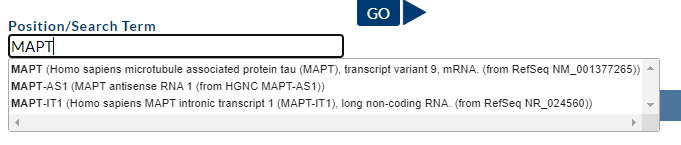
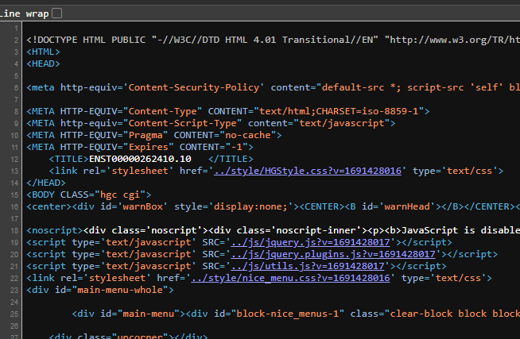

Obtaining exons from individual genes using UCSC Genome Browser
===============================================================

Download HTML
-------------

I used this workflow originally to download exons and introns for each gene
from UCSC genome browser. 

Briefly, go https://genome.ucsc.edu/cgi-bin/hgGateway type a gene symbol in the
"Position/Search Term" field:

Then select a transcript variant for that gene and in the genome browser
display click on that variant:

.. image:: images/ucsc_browser.png

In the following screen click on "Genomic Sequence":

.. image:: images/ucsc_transcript_info.png

Then select whether we only want CDS exons (start with START and ends with
STOP codon) or also include the 5' and 3' UTRs. For PCR based data when
primers were based on the CDS, we ignored UTR. For WGS data, include UTRs:

.. image:: images/ucsc_exons_introns.png

Now save the HTML file by selecting the file source; in Google Chrome the
keyboard shortcut is Ctrl+U. Alternatively, right click in the web browser
and select View Page Source:

Then select the entire text and save it as HTML in a text editor such as
VSCode:

.. image:: images/vscode_html.png

as for example ``mapt_exons.html``.

Parsing HTML to FASTA
---------------------

.. code-block:: bash

    python gencdna/file_api/parse_exons_introns.py \
        mapt_exons.html \
        mapt_exons.fasta \
        --prefix 'MAPT_'

You can also leave the prefix flag empty. This will generate a FASTA file::

    >MAPT_exon_01
    GCAGTCACCGCCACCCACCAGCTCCGGCACCAACAGCAGCGCCGCTGCCACCGCCCACCT
    TCTGCCGCCGCCACCACAGCCACCTTCTCCTCCTCCGCTGTCCTCTCCCGTCCTCGCCTC
    TGTCGACTATCAG
    >MAPT_exon_02
    GTGAACTTTGAACCAGGATGGCTGAGCCCCGCCAGGAGTTCGAAGTGATGGAAGATCACG
    CTGGGACGTACGGGTTGGGGGACAGGAAAGATCAGGGGGGCTACACCATGCACCAAGACC
    AAGAGGGTGACACGGACGCTGGCCTGAAAG
    >MAPT_exon_03
    AATCTCCCCTGCAGACCCCCACTGAGGACGGATCTGAGGAACCGGGCTCTGAAACCTCTG
    ATGCTAAGAGCACTCCAACAGCGGAAG
    ...
